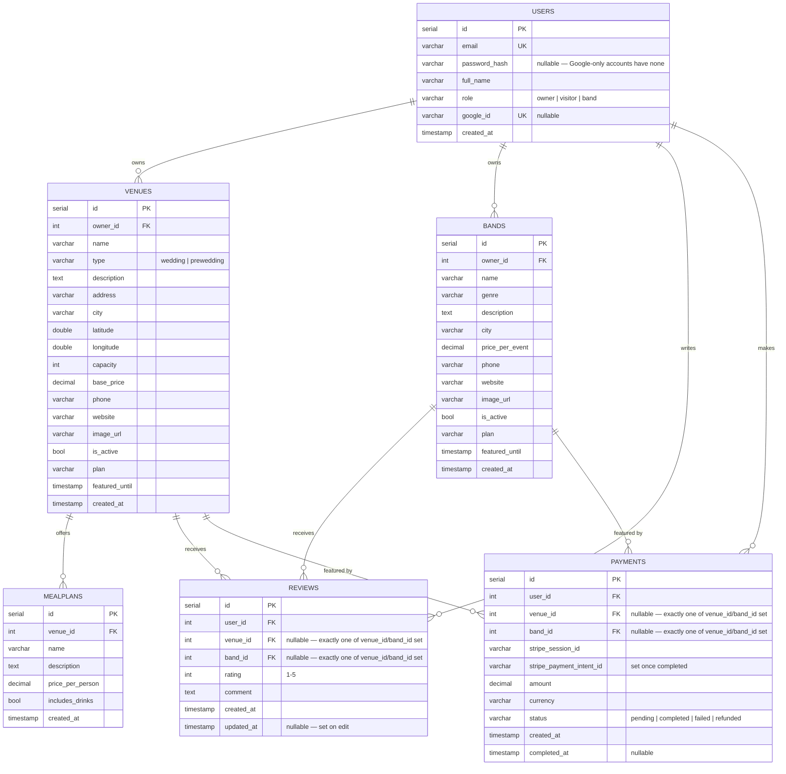

# MyWeddingDay — Database Schema

Entity-relationship diagram for the current (implemented) schema. Renders natively on GitHub.

## Notes

- **Venues** and **Bands** are separate tables (not a shared "listings" table) — see `CLAUDE.md`
  for why. Each has its own `owner_id → Users.id`.
- `MealPlans` belongs only to `Venues`; `Bands` have no meal plans.
- `image_url` is a single column on `Venues`/`Bands` today (not a separate gallery table).
- `plan` / `featured_until` drive the paid "feature this listing" boost — a flat one-time Stripe
  payment sets `plan='featured'` and pushes `featured_until` ~100 years out (no real expiry, per
  the flat-fee pricing decision). Listing creation itself is still free/unpublished-gate-free —
  this is a post-publish upsell only, not full pay-to-publish.
- Users can sign up/log in with email+password, Google Sign-In, or both — `google_id` links a
  row to a Google account once used, and `password_hash` is nullable to allow Google-only
  accounts that never set a password.
- `Reviews` ties a rating (1-5) + comment to a logged-in `user_id` — unlike the anonymous,
  moderated version originally sketched in `er-diagram.html`, this one is tied to a real account
  and shows immediately (no moderation queue). One review per user per venue/band, enforced by
  partial unique indexes on `(user_id, venue_id)` and `(user_id, band_id)`; submitting again
  updates the existing row instead of creating a second one. A listing's own owner can't review it.
- `Payments` is real now (built for the feature-listing boost above) — same exclusive
  `venue_id`/`band_id` FK pattern as `Reviews`. `Images` is still excluded — that one's still
  just a proposal in `er-diagram.html`, not in the running schema.
